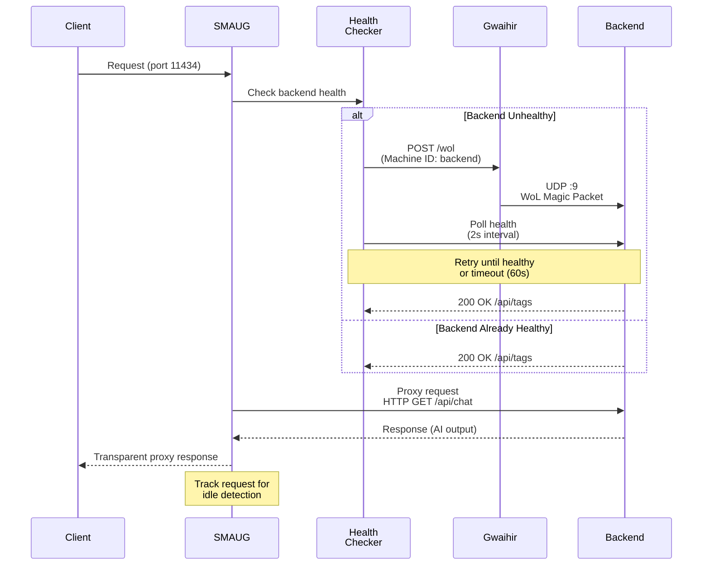

<p align="center">
  
</p>

<h1 align="center">SMAUG</h1>

<p align="center">
  <b>S</b>mart <b>M</b>essenger for <b>A</b>uto-waking <b>U</b>nwake <b>G</b>Hz
</p>

<p align="center">
  <i>Config-driven reverse proxy with automatic Wake-on-LAN for homelab services</i>
</p>

<p align="center">
  <i>"I am fire. I am... asleep until you need me."</i>
</p>

<div align="center">
  <!-- MIT License -->
  <a href="./LICENSE"></a>
  <!-- Go version -->
  <a href="https://go.dev/"></a>
  <!-- Version -->
  <a href="./">
    
  </a>
  <!-- Go Report Card -->
  <a href="https://goreportcard.com/report/github.com/josimar-silva/smaug">
    
  </a>
  <!-- OSSF Score Card -->
  <a href="https://scorecard.dev/viewer/?uri=github.com/josimar-silva/smaug">
    
  </a>
  <!-- Coverage -->
  <a href="https://sonarcloud.io/summary/new_code?id=josimar-silva_smaug">
    
  </a>
  <!-- Gwaihir Health -->
  <a href="https://hello.from-gondor.com/">
    
  </a>
  <!-- Gwaihir Uptime -->
  <a href="https://hello.from-gondor.com/">
    
  </a>
  <!-- Gwaihir Response Time -->
  <a href="https://hello.from-gondor.com/">
    
  </a>
  <!-- CI -->
  <a href="https://github.com/josimar-silva/smaug/actions/workflows/ci.yaml">
    
  </a>
  <!-- CD -->
  <a href="https://github.com/josimar-silva/smaug/actions/workflows/cd.yaml">
    
  </a>
  <!-- Docker -->
  <a href="https://github.com/josimar-silva/smaug/actions/workflows/docker.yaml">
    
  </a>
</div>

---

## Overview

Smaug is a lightweight, production-ready reverse proxy designed for homelab environments. It routes requests to backend services transparently while automatically waking sleeping servers via Wake-on-LAN and putting idle servers to sleep reducing power consumption by 90%+ during idle periods.

Typical homelab GPU servers (Ollama, Marker, Whisper) consume 200-400W when idle. Smaug lets them sleep when not in use and wakes them on-demand, enabling efficient resource management without sacrificing responsiveness.

### Key Features

- **Transparent Proxying:** Routes requests to backend services via port-per-service model
- **Auto-Wake:** Detects sleeping servers and sends WoL packets automatically
- **Auto-Sleep:** Puts idle servers to sleep after configurable timeout
- **YAML Configuration:** Simple, file-driven setup with hot-reload support
- **Observability:** Prometheus metrics, structured JSON logging, health checks
- **Privilege Separation:** Unprivileged proxy + privileged [Gwaihir](https://github.com/josimar-silva/gwaihir) WoL service
- **Kubernetes Native:** Built for K8s deployments with minimal resource footprint
- **Production Ready:** Graceful shutdown, rate limiting, security best practices

---

## Architecture

### High-Level Design


### Request Flow: Wake-on-Demand

When a client requests a backend service, SMAUG orchestrates the wake-up:



**Typical wake latency:** 30-90 seconds (depends on server hardware)

### Request Flow: Auto-Sleep

An idle tracker monitors request activity and puts idle servers to sleep:


---

## Configuration

### Configuration File Format

```yaml
# Global settings
settings:
  gwaihir:
    url: "http://gwaihir-service.ai.svc.cluster.local"
    apiKey: "${GWAIHIR_API_KEY}"  # Env var substitution
    timeout: 5s

  logging:
    level: info
    format: json  # structured logging

  # Observability configuration
  # Controls which infrastructure endpoints are exposed
  observability:
    # Health check endpoints: /health, /live, /ready, /version
    healthCheck:
      enabled: true
      port: 2111

    # Metrics endpoint: /metrics (Prometheus format)
    metrics:
      enabled: true
      port: 2112

# Server definitions
servers:
  saruman:

    wakeOnLan:
      enabled: true
      machineId: "saruman"       # Gwaihir machine ID
      timeout: 60s
      debounce: 5s               # Min interval between WoL attempts

    sleepOnLan:
      enabled: true
      endpoint: "http://saruman.from-gondor.com:8000/sleep"
      authToken: "${SLEEP_ON_LAN_TOKEN}"  # Env var substitution
      idleTimeout: 5m            # Sleep after 5 min idle

    healthCheck:
      endpoint: "http://saruman.from-gondor.com:8000/status"
      authToken: "${HEALTH_CHECK_TOKEN}"  # Optional: base64-encoded user:password for Basic Auth
      interval: 2s
      timeout: 2s

# Route definitions (port-per-service)
routes:
  - name: ollama
    listen: 11434
    upstream: "http://saruman.from-gondor.com:11434"
    server: saruman

  - name: marker
    listen: 8080
    upstream: "http://saruman.from-gondor.com:8080"
    server: saruman
```

### Environment Variables

- `SMAUG_CONFIG` - Path to configuration file (default: `/etc/smaug/services.yaml`)
- `GWAIHIR_API_KEY` - API key for Gwaihir service (required if WoL enabled)
- `SMAUG_LOG_LEVEL` - Log level: debug|info|warn|error (default: info)
- `SMAUG_LOG_FORMAT` - Log format: json|text (default: json)

---

## Getting Started

### Prerequisites

- Go 1.26+ (for building)
- Backend servers with Wake-on-LAN enabled
- [Gwaihir](https://github.com/josimar-silva/gwaihir) service deployed (for WoL functionality)
- Network L2 adjacency for WoL broadcast (same subnet/VLAN)

### Local Development

```bash
# Clone repository
git clone https://github.com/josimar-silva/smaug.git
cd smaug

# Install dependencies
go mod download

# Run tests
just test

# Build binary
just build

# Run locally
export SMAUG_CONFIG=config/smaug.example.yaml
export GWAIHIR_API_KEY=your-secret-key
just run
```

### Docker

```bash
docker run -d \
  --name smaug \
  --network host \
  -v /path/to/config.yaml:/etc/smaug/services.yaml:ro \
  -e GWAIHIR_API_KEY=your-secret-key \
  -e SMAUG_LOG_LEVEL=info \
  ghcr.io/josimar-silva/smaug:latest
```

### Kubernetes

See [docs/adrs/ADR-001-foundation.md](docs/adrs/ADR-001-foundation.md) for complete Kubernetes deployment specifications including Deployment, Service, ConfigMap, NetworkPolicy, and RBAC resources.

Quick start:

```bash
# Create ConfigMap with services.yaml
kubectl create configmap smaug-config --from-file=services.yaml

# Apply manifests
kubectl apply -f deploy/

# Verify
kubectl logs -f deployment/smaug
kubectl port-forward svc/smaug 2112:2112
curl http://localhost:2112/metrics
```

---

## Development

### Project Structure

```
internal/
├── proxy/            # Proxy and routes
├── store/            # Storage
├── health/           # Server health checker
├── config/           # Configuration parsing
├── middleware/       # HTTP middleware
├── infrastructure/   # Logging, metrics, etc.
├── management/       # Server Management
└── client/           # External service clients (Gwaihir, sleep)

cmd/smaug/            # Application entry point
tests/                # Integration tests
config/               # Example configurations
```

### Build & Test

```bash
# Format and lint
just format
just lint

# Run all checks
just pre-commit

# Run tests with coverage
just test

# Run with race detector
go test -race ./...

# Build binary
just build

# Build Docker image
just docker-build latest
```

### Architecture Decisions

Key decisions documented in [ADRs](docs/adrs/README.md):

---

## Observability

### Prometheus Metrics

Available on port 2112 (`/metrics` endpoint).

Key metrics:

- `smaug_wake_attempts_total` - WoL wake attempts by server and success status
- `smaug_server_awake` - Server state gauge (1=awake, 0=sleeping) by server
- `smaug_health_check_failures_total` - Health check failures by server and reason
- `smaug_sleep_triggered_total` - Servers put to sleep due to idle timeout
- `smaug_request_duration_seconds` - Proxy request latency (histogram)
- `smaug_requests_total` - Total HTTP requests processed
- `smaug_requests_by_status_total` - HTTP requests by status code
- `smaug_requests_by_method_total` - HTTP requests by method
- `smaug_config_reload_total` - Config reload attempts by success status
- `smaug_gwaihir_api_calls_total` - Gwaihir API calls by operation and success status
- `smaug_gwaihir_api_duration_seconds` - Gwaihir API call duration (histogram)

### Structured Logging

JSON logs for log aggregation (ELK, Loki, etc).

Example log entry:

```json
{
  "level": "info",
  "timestamp": "2026-02-11T10:30:45Z",
  "msg": "wol_sent",
  "server": "saruman",
  "duration_ms": 120
}
```

### Health Checks

Management server runs on port 2111 (configurable) and exposes:

- **`/live`:** Kubernetes liveness probe — returns `{"status":"alive"}` when the process is running
- **`/ready`:** Kubernetes readiness probe — returns 503 when no routes are active
- **`/health`:** Overall application health including active route count and uptime
- **`/version`:** Build version, git commit, and build time

K8s probes configured in deployment manifest.

---

## Security

### Design

- **Privilege Separation:** SMAUG runs unprivileged, Gwaihir handles WoL with elevated privileges
- **Network Isolation:** NetworkPolicy restricts SMAUG → Gwaihir, Prometheus → metrics
- **Authentication:** Gwaihir API key stored in K8s Secret (not ConfigMap)
- **Input Validation:** Config schema validation, URL parsing
- **Rate Limiting:** 1 WoL request per 10s per server, prevents DoS attacks
- **Secret Redaction:** API keys and auth tokens are redacted in logs and config marshalling

### Threat Mitigations

| Threat | Mitigation |
|--------|-----------|
| Gwaihir API abuse | API key auth + NetworkPolicy + rate limiting |
| Config tampering | RBAC + validation + hash verification |
| Wake flooding DoS | Rate limiting (1/10s per server) + debounce |
| Sleep API SSRF | Endpoint validation + scheme validation |
| Metrics info disclosure | NetworkPolicy (Prometheus only) |
| Secret leakage in logs | SecretString type redacts values in all output |

See [ADR-001: Security Considerations](docs/adrs/ADR-001-foundation.md#security-considerations) for full threat model.

---

## Performance

### Resource Usage (Estimated)

| Metric | Idle | Active (10 req/s) |
|--------|------|-------------------|
| CPU | 10m | 100m |
| Memory | 50Mi | 128Mi |
| Network | <1 Mbps | Depends on backend responses |

### Latency

| Scenario | Latency |
|----------|---------|
| Backend awake, healthy | ~5ms (proxy overhead) |
| Backend sleeping, wake succeeds | 30-90s (WoL + boot time) |
| Backend unreachable | 2s (health check timeout) |

### Scalability

- **Routes:** No practical limit (each route is independent listener)
- **Servers:** Tested with 10+ servers without issues
- **Concurrency:** Limited by backend capacity (SMAUG adds minimal overhead)

See [ADR-001: Performance Characteristics](docs/adrs/ADR-001-foundation.md#performance-characteristics) for detailed benchmarks.

---

## Contributing

We welcome contributions! See [CONTRIBUTING.md](CONTRIBUTING.md) for guidelines on:

- Code standards (SOLID, functional principles)
- Test-driven development (TDD)
- Commit practices (atomic commits, conventional commits)
- Pull request workflow

### Development Requirements

- Go 1.26+
- `just` for task running
- `golangci-lint` for linting
- Docker for container builds

### Code Quality

Before submitting PRs:

```bash
# Format code
just format

# Run linters
just lint

# Run all pre-commit checks
just pre-commit

# Ensure 90%+ test coverage
just test
```

---

## Troubleshooting

### WoL Not Working

1. Verify Gwaihir is deployed and reachable
2. Check `GWAIHIR_API_KEY` is set correctly
3. Verify backend has WoL enabled in BIOS
4. Ensure network L2 adjacency (same subnet/VLAN)
5. Check logs: `kubectl logs -f deployment/smaug | grep wol`

### Servers Not Sleeping

1. Verify `sleepOnLan.enabled: true` in config
2. Check backend has sleep endpoint (e.g., `POST /sleep`)
3. Verify `idleTimeout` is reasonable (default 5m)
4. Monitor logs for `sleep_triggered` events

### Proxy Timeouts

1. Increase `healthCheck.timeout` if backend is slow to respond
2. Increase `wakeOnLan.timeout` if servers take > 60s to wake
3. Check backend logs for errors
4. Monitor latency with `smaug_request_duration_seconds` metric

### Config Reload Issues

1. Validate YAML syntax: `yamllint services.yaml`
2. Check logs for `config_reload_failed` errors
3. Previous config is kept on reload failure (no downtime)
4. Review [Configuration](#configuration) section

---

## Related Projects

- [Gwaihir](https://github.com/josimar-silva/gwaihir) - Privileged WoL messenger service

---

## Documentation

- [ADRs](docs/adrs/README.md) - Comprehensive design decisions, deployment specs, security model, observability strategy
- [CONTRIBUTING.md](CONTRIBUTING.md) - Contribution process and standards

---

## License

This project is licensed under the MIT License - see [LICENSE](LICENSE) file for details.

---
